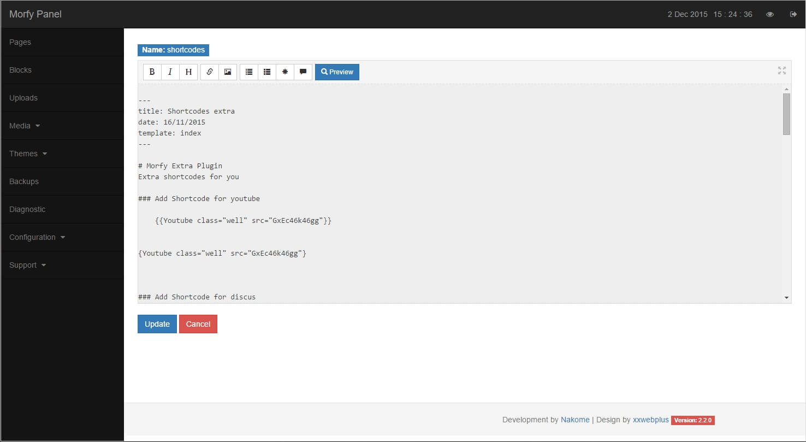
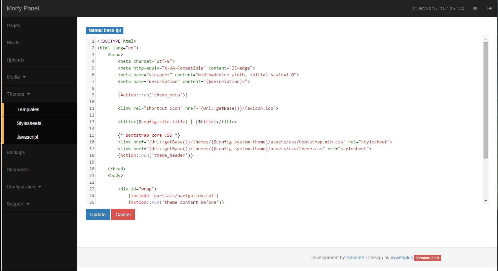
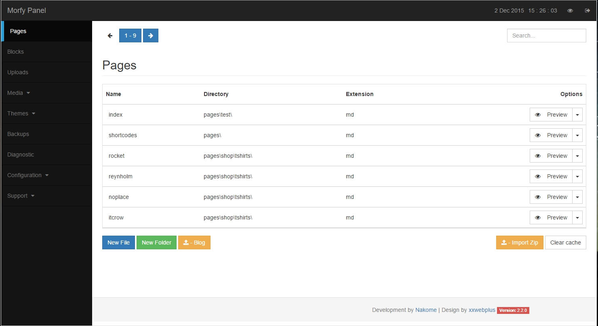

# Morfy-Panel 2.1.0

Backend for [Morfy CMS](http://morfy.org)

## Requirements
Operation system: Unix, Linux, Windows, Mac OS  
Middleware: PHP 5.5 or higher with PHP's [Multibyte String module](http://php.net/mbstring)   
Webserver: Apache with [Mod Rewrite](http://httpd.apache.org/docs/current/mod/mod_rewrite.html)  

---

## Screenshots
	
### Dashboard

### Edit

### Full screen edit

### Pages section

---

## Instructions

Copy admin folder in root of website

Go to config/site.yml and **edit:**

	author:
	  email: 'demo@gmail.com'
	  
	  

	# admin folder
	backend_folder: 'admin'
	# password
	backend_password: 'demo'
	# Language  en,es,gr,ru 
	backend_language: 'en'
	# pagination pages/blocks templates etc..
	backend_pagination_pages: 6
	# pagination uploads
	backend_pagination_uploads: 6
	# pagination all media 
	backend_pagination_media_all: 3
	# pagination single item
	backend_pagination_media: 16
	# admin charset
	backend_charset: UTF-8
	# root url
	site_url: 'http://localhost'

**Note:**

if you like ,you can change folder name of admin.
- rename $backend var in admin/index.php
- rename backend_folder in site.yml
- Go to url /admin of your admin folder name and login

**Thats it !**

---

## Json structure of media elements

	}
		"1447007935": {
			"id": 1447007935,
			"title": "The blue Worlds",
			"desc": "Many pics of blue worlds by uspslash.com",
			"thumb": "/public/media/album_thumbs/album_1447007935.jpg",
			"images": "/public/media/albums/album_1447007935",
			"tag": "blue",
			"width": "800",
			"height": "500"
		}
	}

You can use media plugin to show images:

Copy media folder in plugins folder
Enable on site.yml

	plugins
		media

---

# Morfy Media Plugin

Extends Media section in frontend of Morfy Panel

##Documentation

Create a media.md file on storage/pages folder with template media.tpl like this:

		---
		title: Media example
		description: Media items for gallery or portfolio
		template: media
		---

Create a media.tpl file on themes/default-theme folder like this:

File **media.tpl**

		{extends 'partials/base.tpl'}
		{block 'content'}
			

			    {Action::run('Media')}
			

		{/block}
